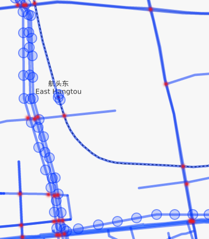
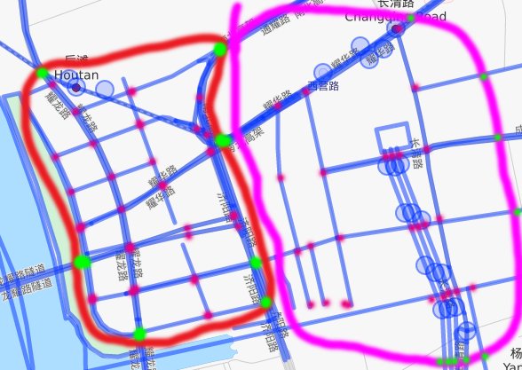

# Project Report

**Shiyi Lan**   
**Fudan University**

## Abstract

The shortest path problems is widely used in the real world 
	map. Also real-time traffic information and high-frequency queries
	from client are popular problems people concentrates in. To solve the
	the two problems, we introduce some good algorithms which perform 
	very well in the Shanghai map and are also state-of-art methods in
	algorithms competition. We use Cellular Automaton Algorithms, Split 
	of Balance, Dijkstra with heap. We apply those 
	algorithms on Shanghai Map and achieve that the algorithm complexity 
	of prework limits to O(n^2\*log(n)), the algorithm complexity of query
	limits to O(1) in static map (without real-time traffic information)
	and the algorithm complexity of prework limits to O(n\*sqrt(n)\*log(n)), 
	the algorithm complexity of query limits to O(sqrt(n)\*log(n)) in dynamic, 
	map (with real-time traffic information).

## Static Map
	
#### Background

In most cases, we only want to get an overview of where we want to go and
	which road we will go through. We only need a static map without traffic
	information. In this part, we will introduce the fastest method of shortest path
	with algorithm complexity limiting to O(1).
	
As we extract the information of shanghai map, we found that there are about
	500,000 points in the map. But actually, there are only about 30,000 points
	we really need to consider in the shortest path problems. And reason why such
	few points are useful is that they are not cross points with degree greater 
	than 2.(figure1)
	

	
(figure1. lots of points in the road but only several cross points)
	
I
#### Algorithm
	
	
So the points in the road can be combined to a big edge between two points 
	around them and we can only calculate all pairs of shortest path in the
	cross points set in prework.
	
A shortest path query of two points (u,v) in the real map consists of 3 conditions we will
	meet:
	
1. Both u and v are cross points. As we have calculated all pairs of shortest
	path, we can easily get the answer.

2. Neither u nor v is not cross point. According to the definition of not cross
	points, they are both on the same edge. We define **end nodes** of each not cross 
	points the cross points **around them** (figure 2). The end nodes are cross nodes. 
	So we can get the shortest path between them. The end nodes of u are u_a, u_b, 
	and the end nodes of v are v_a, v_b. The value of shortest path between them is
				
		min{
			dis(u_a, v_a) + dis(u_a, u) + dis(v_a, v),
			dis(u_a, v_b) + dis(u_a, u) + dis(v_b, v),
			dis(u_b, v_a) + dis(u_b, u) + dis(v_a, v),
			dis(u_b, v_b) + dis(u_b, u) + dis(v_b, v)
		}
				
	All of them are calculated in the prework.
	
	3. Node u is the cross point, but v is not cross point. Similar to condition(2),
	we use the shortest distance between cross points and the shortest distance between
	not cross points and their end nodes. The value is 
	
		min{
			dis(u_a, v) + dis(u, u_a),
			dis(u_b, v) + dis(u, u_b)
		}
				
	All the above data is calculated in the prework. So the complexity of query is O(1).
	
	

I
(figure2. 7 not cross points in the road are colored yellow, and their **end nodes** are colored red. )

	
	
### Analysis of Algorithm Complexity &  Experiment Records.
	

Dijkstra with heap is a popular shortest path algorithm with complexity of O(m\*logm), where the m 
indicates the number of edges (which are twice greater than the number of nodes). To 
calculate all pairs of shortest path, we perform SPFA for each cross node, so the 
complexity of algorithm is O(n^2*log(n)).
	
In this experiment we extract 29713 cross nodes from the map, and the number of total
nodes is 504192. The prework cost about 20min on Mac OSX El Capitan, Processor 2.6 GHz 
Intel Core i5, Memory 8 GB 1600 MHz DDR3. And it doesn't get to its extreme performance,
due to not enough memory(it will take up about 12G, the rest 4G data is stored in tmp 
provided by SSD) and with lots of I/O operations and going through layers (socket -> 
nodejs -> c++), but still can deal with 30,000 queries per second w.r.t. 10,000,000 per
second.
	
	
	
## Dynamic Map

### background
	
Congested traffic has become a big trouble in modern city, especially in such cities
with a large number of popularity like Beijing, Shanghai. To help people avoid traffic
jam, we need to take traffic information into consideration when calculating the shortest
path for clients.

To meet the requirement, we should reduce the complexity of calculating shortest path in
the prework. Meanwhile, the query excutive time must keep as quick as possible. It's significant to find the balance point.

### Algorithm

On the base of previous work, we can reduce the map scale to about 30,000 nodes, although it
only need 5 mins to recalculate to do prework, it can't work on China map because it takes up too much memory. In order to perform this map engine on larger map, we introduce Cellular Automaton Algorithm to split the map into sqrt(n) parts for faster prework. We divide all the points into
around O(sqrt(n)) groups according to the geography. (see figure3)

(green: entrance point, red: internal point. All those points are cross points)

In a block, there are some entrance points and internal points. Similar to previous work, we want to take the block and its entrance points into consideration instead of its internal points in shortest path problem. Before we classify query(u,v), we introduce 2 important concepts in our algorithms: **shortest paths between blocks**, **out path of internal points**.

1. Shortest paths between blocks. There are 2 blocks a and b, a has a_n entrances, b has b_n entrances. The shortest path between blocks is a matrix m size of a_n x b_n, where m_a_b(i, j) stands for the shortest distance between the ith entrance in a and the jth entrance in b. 

2. Out path of internal points. There is an internal point u and its block a, a has a_n entrances. Out path of u is a vector v, where v_i stands for the shortest distance between v_i and u in the subgraph of block a.

Now let's solve the shortest path probles. There are 2 conditions of query (u,v).

1. Both u and v are in the same block. In this case, we will calculate the shortest path in the block a whice means that we only consider the points in this block. And then we calculate min{ m_a_a(i,j) + v_u(i) + v_v(j) }.

2. u and v are not in the same block. Calculate min{ m_a_b(i,j) + v_u(i) + v_v(j)}

In the prework, we calculate the matrix m_a_b and v_i in O(n\*log(n)). 

1. v_i. It's easy to calculate v_i in O(sqrt(n)*log(n)). And for each block, we need perform this algorithm for O(sqrt(n)) times. So the total complexity is O(nlog(n)).

2. m_i_j. If we know the shortest path value between each entrance, the work is done. So we define initial value of m_i_j min{v_u(i) + v_v(i)} and then perform dijstra with heap on the matrix whosh complexity is O(n\*sqrt(n)).

And how can I get a good cut of the map? see my [distributed-system-project](https://github.com/voidrank/distributed-system-project).

(Due to the time limit, I didn't implement this part. And I think my previous algorithm is good enough for Shanghai map. And this algorithm is just a bonus.)

